# Lead Submission Application

A modern web application built with Next.js for collecting and managing leads.

## Project Architecture


```
src/
├── app/
│   └── api/
│       └── leads/
│           └── route.ts         # API endpoint for leads
├── components/
│   └── LeadSubmissionForm.tsx   # Main form component
├── server/
│   ├── actions/
│   │   └── lead.actions.ts      # Business logic
│   └── data/
│       └── lead.data.ts         # Database operations
├── types/
│   ├── index.ts                 # Type exports
│   ├── api.types.ts             # API response types
│   └── lead.types.ts            # Domain types
└── lib/
    └── db/
        └── prisma.ts            # Database client
```

### Type System

The type system is organized in the `src/types` directory:

```
src/types/
├── index.ts                     # Central export point
├── api.types.ts                 # Generic API response types
└── lead.types.ts                # Domain-specific types
```

1. **API Types** (`api.types.ts`)

   - Generic response structures
   - Shared across all API endpoints
   - Example: `ApiResponse<T>`

2. **Domain Types** (`lead.types.ts`)

   - Business domain specific types
   - Input/Output types for leads
   - Status types for UI states

3. **Type Flow**

   ```mermaid
   graph LR
   A[Domain Types] --> B[API Types]
   B --> C[Response Types]
   style A fill:#e3f2fd
   style B fill:#fff3e0
   style C fill:#f3e5f5
   ```

### Key Components Explained

1. **Frontend (Components)**

   - `LeadSubmissionForm`: A form component that collects email and phone information
   - Uses shadcn/ui components for consistent styling

2. **API Layer**

   - Located in `app/api/leads/route.ts`
   - Handles HTTP requests and responses
   - Connects frontend to server actions

3. **Server Layer**

   - **Actions**: Business logic and error handling
   - **Data**: Direct database operations using Prisma

4. **Database**

   - MongoDB with Prisma as ORM
   - Stores lead information (email, phone, timestamp)

## Data Flow

```mermaid
sequenceDiagram
participant U as 👤 User
participant F as 📝 Form
participant A as 🔄 API
participant S as ⚙️ Actions
participant D as 💾 Database
U->>+F: Enter Data
F->>+A: POST /api/leads
A->>+S: createLead()
S->>+D: createLeadInDb()
D-->>-S: Lead Created
S-->>-A: Success Response
A-->>-F: 201 Created
F-->>-U: Show Success Message
note over F,A: Includes email & phone
note over S,D: Prisma handles DB operation
```



## Technologies Used

- Next.js 14 (App Router)
- MongoDB
- Prisma ORM
- TypeScript
- Tailwind CSS
- shadcn/ui

## Getting Started

1. Clone the repository
2. Install dependencies:
   ```bash
   npm install
   ```
3. Set up environment variables:
   ```env
   DATABASE_URL="your_mongodb_url"
   ```
4. Run development server:
   ```bash
   npm run dev
   ```

## Project Decisions

- **Why MongoDB?**

  - Flexible schema
  - Perfect for lead data
  - Easy to scale

- **Why Prisma?**

  - Type-safe database operations
  - Excellent developer experience
  - Automatic migrations

- **Why Server Actions?**

  - Clean separation of concerns
  - Better error handling
  - Improved maintainability
