# Offertu

A modern web application built with Next.js for collecting and managing leads. (for now)

## Project Architecture


```
src/
├── app/
│   ├── anvandarvillkor/        # User terms
│   ├── api/
│   │   ├── leads/
│   │   │   └── route.ts        # API endpoint for leads
│   │   └── sheets/
│   │       └── sync/
│   │           └── route.ts    # Sync endpoint
│   ├── api-dokumentation/      # API documentation
│   ├── integritetspolicy/      # Privacy policy
│   ├── karriarer/              # Careers
│   ├── mallar/                 # Templates
│   ├── nyheter/                # News
│   ├── tack/                   # Thank you
│   ├── verktyg-resurser/       # Tools and resources
│   ├── favicon.ico             # Favicon
│   ├── globals.css             # Global styles
│   ├── layout.tsx              # Root layout
│   ├── not-found.tsx          # 404 page
│   └── page.tsx               # Home page
├── components/
│   ├── dashboard/             # Dashboard components
│   ├── landing-page/          # Front page components
|   ├── ui/                    # UI components
│   ├── Footer.tsx             # Footer component
│   ├── LeadForm.tsx           # Main form component
│   └── Navbar.tsx             # Navigation menu
├── lib/
│   ├── db/
│   │   └── prisma.ts         # Database client
│   ├── errors/
│   │   └── app.errors.ts     # Error messages
│   ├── validations/
│   │   └── lead.validation.ts # Validations
│   ├── utils.ts              # Utility functions
│   └── services/
│       ├── sheets.service.ts  # Google Sheets operations
│       └── db-sync.service.ts # MongoDB change streams
├── server/
│   ├── actions/
│   │   └── lead.actions.ts   # Business logic
│   └── data/
│       └── lead.data.ts      # Database operations
└── types/
├── index.ts              # Type exports
├── api.types.ts          # API response types
└── lead.types.ts         # Domain types
```

### Type System

The type system is organized in the `src/types` directory:

```
src/types/
   ├── index.ts                # Type exports
   ├── api.types.ts            # API response types
   └── lead.types.ts           # Domain types
```

1. **API Types** (`api.types.ts`)

   - Generic response structures
   - Shared across all API endpoints
   - Example: `ApiResponse<T>`

2. **Error Types** (`error.types.ts`)

   - Centralized error handling
   - Predefined error messages
   - Consistent error responses
   - Example: `ErrorMessages.INTERNAL_SERVER_ERROR`

3. **Domain Types** (`lead.types.ts`)

   - Business domain specific types
   - Input/Output types for leads
   - Status types for UI states

4. **Type Flow**


### Key Components Explained

1. **Frontend (Components)**

   - `LeadSubmissionForm`: A form component that collects email and phone information
   - Uses shadcn/ui components for consistent styling

2. **API Layer**

   - Located in `app/api/leads/route.ts`
   - Handles HTTP requests and responses
   - Connects frontend to server actions

3. **Server Layer**

   - **Actions**: Business logic and error handling
   - **Data**: Direct database operations using Prisma

4. **Database**

   - MongoDB with Prisma as ORM
   - Stores lead information (email, phone, timestamp)

## Data Flow

```mermaid
sequenceDiagram
participant U as 👤 User
participant F as 📝 Form
participant A as 🔄 API
participant S as ⚙️ Actions
participant D as 💾 Database
U->>+F: Enter Data
F->>+A: POST /api/leads
A->>+S: createLead()
S->>+D: createLeadInDb()
D-->>-S: Lead Created
S-->>-A: Success Response
A-->>-F: 201 Created
F-->>-U: Show Success Message
note over F,A: Includes email & phone
note over S,D: Prisma handles DB operation
```



## Technologies Used

- Next.js 14 (App Router)
- MongoDB
- Prisma ORM
- TypeScript
- Tailwind CSS
- shadcn/ui

## Getting Started

1. Clone the repository
2. Install dependencies:
   ```bash
   npm install
   ```
3. Set up environment variables:
   ```env
   DATABASE_URL="your_mongodb_url"
   ```
4. Run development server:
   ```bash
   npm run dev
   ```

## Google Sheets Integration

The application includes real-time synchronization between MongoDB and Google Sheets, enabling automatic updates of lead data in a spreadsheet.

### How it Works


The synchronization system:

- Monitors MongoDB for changes using Change Streams
- Automatically updates Google Sheets when:
  - New leads are created
  - Existing leads are updated
  - Leads are deleted
- Provides initial sync of existing data

### Setup Requirements

1. **Google Cloud Project**

   - Enable Google Sheets API
   - Create Service Account
   - Generate credentials

2. **Environment Variables**

   ```env
   DATABASE_URL="mongodb_url"
   GOOGLE_SHEET_ID="your_sheet_id"
   GOOGLE_SERVICE_ACCOUNT_EMAIL="service_account_email"
   GOOGLE_PRIVATE_KEY="private_key"
   ```

3. **Google Sheet**
   - Create a spreadsheet
   - Share with service account email
   - Structure:
     - Column A: Email
     - Column B: Phone
     - Column C: Created At

### Project Structure Updates

```
src/
├── lib/
│   └── services/
│       ├── sheets.service.ts    # Google Sheets operations
│       └── db-sync.service.ts   # MongoDB change streams
└── app/
    └── api/
        └── sheets/
            └── sync/
                └── route.ts     # Sync endpoint
```

### Initialization

The Google Sheets synchronization starts automatically when the application receives its first request. No manual initialization is required.

This will:

1. Sync all existing leads
2. Start monitoring for changes
3. Enable real-time updates

## Project Decisions

- **Why MongoDB?**

  - Flexible schema
  - Perfect for lead data
  - Easy to scale

- **Why Prisma?**

  - Type-safe database operations
  - Excellent developer experience
  - Automatic migrations

- **Why Server Actions?**

  - Clean separation of concerns
  - Better error handling
  - Improved maintainability
